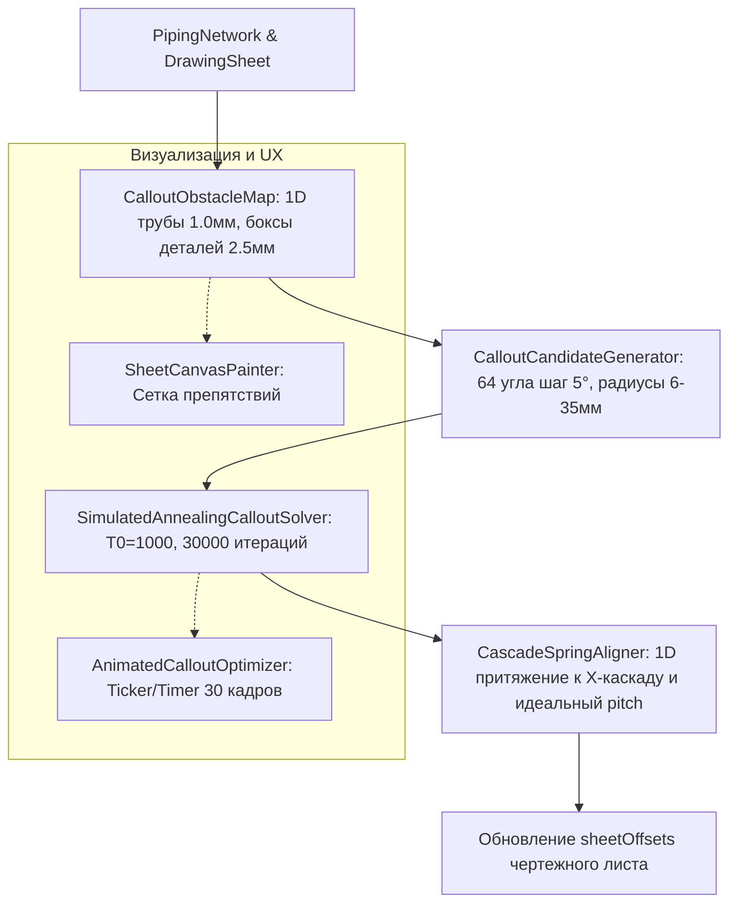

# Спецификация: Глобальный оптимизатор расстановки выносок (Dense Simulated Annealing + 1D Spring Align) с визуализацией препятствий и анимацией

**Дата:** 27 сентября 2026 г.  
**Статус:** Согласовано с пользователем, готово к реализации  
**Целевой проект:** Akso (3D CAD/BIM исполнительных схем трубопроводов)

---

## 1. Введение и постановка задачи

### 1.1. Проблема локальных (жадных) алгоритмов
Существующий жадный (greedy first-fit) и пошаговый лучевой поиск обрабатывает выноски последовательно:
1. Выноски, стоящие первыми в очереди, занимают идеальные микро-карманы.
2. К концу списка в плотных изометрических узлах свободного места не остаётся, и последующие выноски вынуждены либо перекрывать соседние элементы, либо отлетать на дальние расстояния (30–45 мм), нарушая гармонию чертежа.
3. Ограничение углами $30^\circ, 45^\circ, 60^\circ$ не позволяет стрелке проскользнуть в узкую щель между двумя параллельными трубами, где угол мог бы составить $35^\circ$ или $55^\circ$.

### 1.2. Решение: Глобальная оптимизация (Simulated Annealing) + 1D Spring Align
Человек-проектировщик мыслит глобально, оценивая весь чертеж целиком. Для достижения профессионального качества верстки по ГОСТ 21.101 и ГОСТ 2.316 реализуется **двухфазный глобальный оптимизатор**:
1. **Генерация плотного пула кандидатов с шагом $5^\circ$ (Dense Candidate Pool):**  
   Для каждой выноски формируется пул из 30–50 допустимых слотов (64 угла с шагом $5^\circ$, радиусы 6–35 мм). Любые углы разрешены, а классические углы $30^\circ/45^\circ/60^\circ$ получают мягкий эстетический бонус.
2. **Фаза 1: Имитация отжига (Simulated Annealing):**  
   Глобальный стохастический решатель за $20\,000 \dots 40\,000$ микро-итераций минимизирует общую энергию чертежа $E$, устраняя все наложения полочек, перехлесты стрелок и пересечения с чужими трубами.
3. **Фаза 2: Каскадная пружинная кристаллизация (1D Spring Align):**  
   Полочки, оказавшиеся рядом, притягиваются одномерными пружинами к единой вертикали $X_{\text{cascade}}$ и расставляются с идеальным шагом строки $\Delta Y_{\text{pitch}}$, образуя безупречный строгий каскад.
4. **Инструменты визуализации (UX & Debug):**  
   - **Debug Overlay (Сетка препятствий):** подсветка 1D-коридоров труб, боксов арматуры/фитингов и лучей кандидатов прямо на чертеже.
   - **Animated Solve (Анимация процесса):** опциональный плавный визуальный показ распутывания выносок за 1–1.5 секунды.

---

## 2. Архитектура подсистемы



---

## 3. Детальное описание компонентов

### 3.1. Генератор плотного пула кандидатов (`CalloutCandidateGenerator`)
Для каждого элемента/выноски формируется список геометрически допустимых положений:
- **Углы веера:** Все 4 квадранта с шагом $5^\circ$ в диапазонах $[10^\circ \dots 80^\circ]$, $[100^\circ \dots 170^\circ]$, $[190^\circ \dots 260^\circ]$, $[280^\circ \dots 350^\circ]$ (чисто ортогональные исключаются).
- **Радиусы колец:** $r \in [6.0, 8.0, 10.0, 12.5, 15.5, 19.0, 23.5, 29.0, 35.0]$ мм.
- **Модель кандидата (`CalloutCandidateSlot`):**
  ```dart
  class CalloutCandidateSlot {
    final Offset entryShelf;      // Точка излома (начало полочки)
    final Offset shelfEnd;        // Конец полочки
    final bool isRight;           // Направление полочки (вправо/влево)
    final Rect boundingBox;       // Габарит полочки + верхний и нижний текст + зазор 0.8мм
    final double radius;          // Длина наклонной стрелки
    final double angleRad;        // Угол наклона стрелки
    final double localStaticCost; // Стоимость расстояния + бонус за классический угол 45°
  }
  ```
- **Предварительная фильтрация (Hard Pruning):**
  Слоты, габарит которых выходит за рамку листа или попадает на штамп/таблицы или физически накладывается на оси труб с зазором $< 0.8$ мм, сразу отсекаются.

### 3.2. Глобальный решатель отжига (`SimulatedAnnealingCalloutSolver`)
- **Вектор состояния:** Массив индексов $S = [s_0, s_1, \dots, s_{N-1}]$, где $s_i$ — выбранный слот для $i$-й выноски.
- **Глобальная функция энергии $E(S)$:**
  $$E(S) = \sum_{i} \text{CostLocal}(s_i) + \sum_{i < j} \text{ConflictCost}(s_i, s_j)$$
  где парные конфликты оцениваются строго:
  - Наложение габаритных боксов полочек друг на друга: $+100\,000\,000$;
  - Пересечение наклонных стрелок/полочек друг с другом (`segmentsIntersect`): $+50\,000\,000$;
  - Пересечение стрелки с чужими трубами сети: $+2\,000\,000$;
  - Стрелка пересекает габарит чужой полочки: $+30\,000\,000$;
  - Бонус за каскадность (если две соседние полочки имеют $|\Delta X| \le 1.0$ мм и не пересекаются): $-50.0$.
- **Быстрый инкрементальный расчет ($\Delta E$):**
  При изменении слота у выноски $i$ пересчитываются только её связи с остальными $N-1$ выносками за $O(N)$ операций. При $N = 30$ один шаг отжига занимает микросекунды!
- **Параметры отжига:**
  - $T_0 = 1000.0$, $T_{\text{end}} = 0.1$;
  - Коэффициент охлаждения $\alpha = 0.999$;
  - Число итераций: $25\,000 \dots 40\,000$ (суммарное время расчета в Dart $\approx 150 \dots 300$ мс).
  - Вероятность принятия ухудшения: $P = \exp(-\Delta E / T)$.

### 3.3. Каскадное пружинное выравнивание (1D Spring Align)
После того как отжиг определил оптимальные углы и стороны для всех выносок:
1. Выполняется кластеризация полочек, смотрящих в одну сторону (например, вправо) с близкими координатами $X$ ($|\Delta X| \le 4.0$ мм) и близкими по высоте ($|\Delta Y| \le 50.0$ мм).
2. Для каждого такого кластера:
   - Рассчитывается единый $X_{\text{cascade}} = \text{median}(X_i)$;
   - Сортируются выноски по положению их анкеров вдоль трассы;
   - Назначаются строго фиксированные высоты $Y_k = Y_{\text{start}} + k \cdot \Delta Y_{\text{pitch}}$, исключая наложения и формируя безупречную лесенку.

### 3.4. Отладочный оверлей (Debug Canvas Overlay)
- В `SheetCanvasPainter` добавляется отладочный слой отрисовки (управляется флагом `debugShowObstacles`):
  - 1D-коридоры труб рисуются полупрозрачными красными линиями с шириной $2.0$ мм (радиус 1.0 мм);
  - Габариты арматуры, фитингов, опор и стыков — желтыми полупрозрачными прямоугольниками;
  - Штамп и спецификации — пурпурными защитными зонами;
  - Проверенные точки кандидатов — мелкими точками (зеленый = чистый слот, оранжевый = легкий штраф, красный = коллизия).

### 3.5. Анимированный оптимизатор (Animated Solve)
- При включенной опции анимации в UI:
  - Решатель запускается с порциями итераций (например, 30 кадров по 1000 итераций с интервалом 30–40 мс).
  - На каждом кадре `sheetOffsets` обновляются промежуточным состоянием и вызывается `notifyListeners()`.
  - Пользователь видит красивый эффект: выноски за 1 секунду плавно распутываются из хаотичного клубка и строго кристаллизуются по полочкам.

---

## 4. План тестирования и верификации
1. **Тесты генератора кандидатов (`test/callout_candidate_generator_test.dart`):**
   - Проверка генерации 64 углов с шагом $5^\circ$;
   - Проверка корректного отсева кандидатов на штампе и выходе за границы рамки листа.
2. **Тесты отжига (`test/simulated_annealing_solver_test.dart`):**
   - Тест на плотном узле (5 элементов на короткой трубе): 0 пересечений стрелок, 0 наложений полочек.
   - Проверка сходимости: энергия $E$ гарантированно снижается и достигает нуля жестких коллизий.
3. **Тесты пружинного выравнивания (`test/cascade_spring_aligner_test.dart`):**
   - Выравнивание полочек в строгую вертикальную линию с единым шагом.
4. **Общая верификация проекта:**
   - Запуск `flutter analyze` (0 ошибок, 0 замечаний).
   - Актуализация `PROJECT_MEMORY.md` и обновление графа знаний `graphify`.
