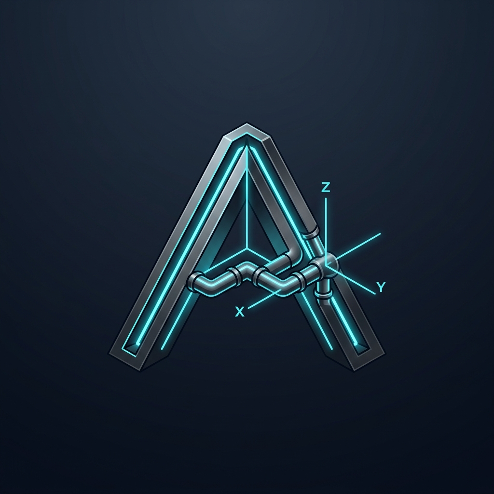
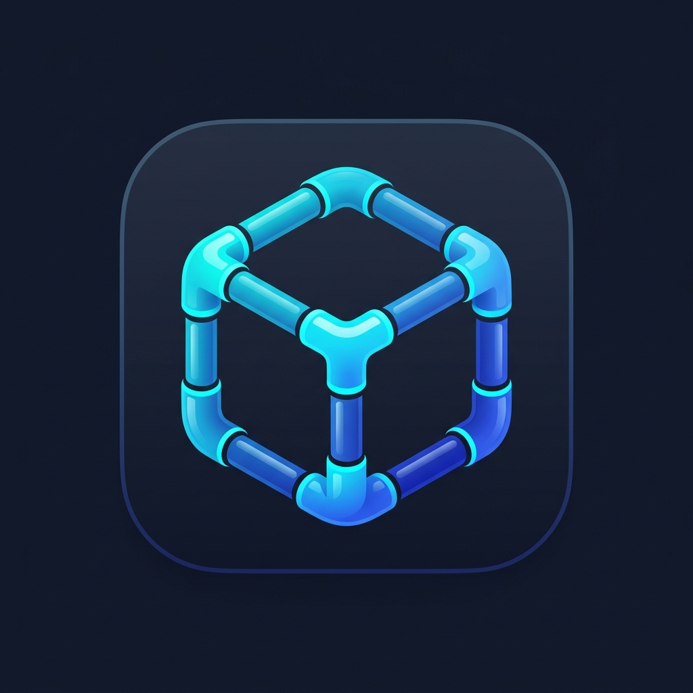
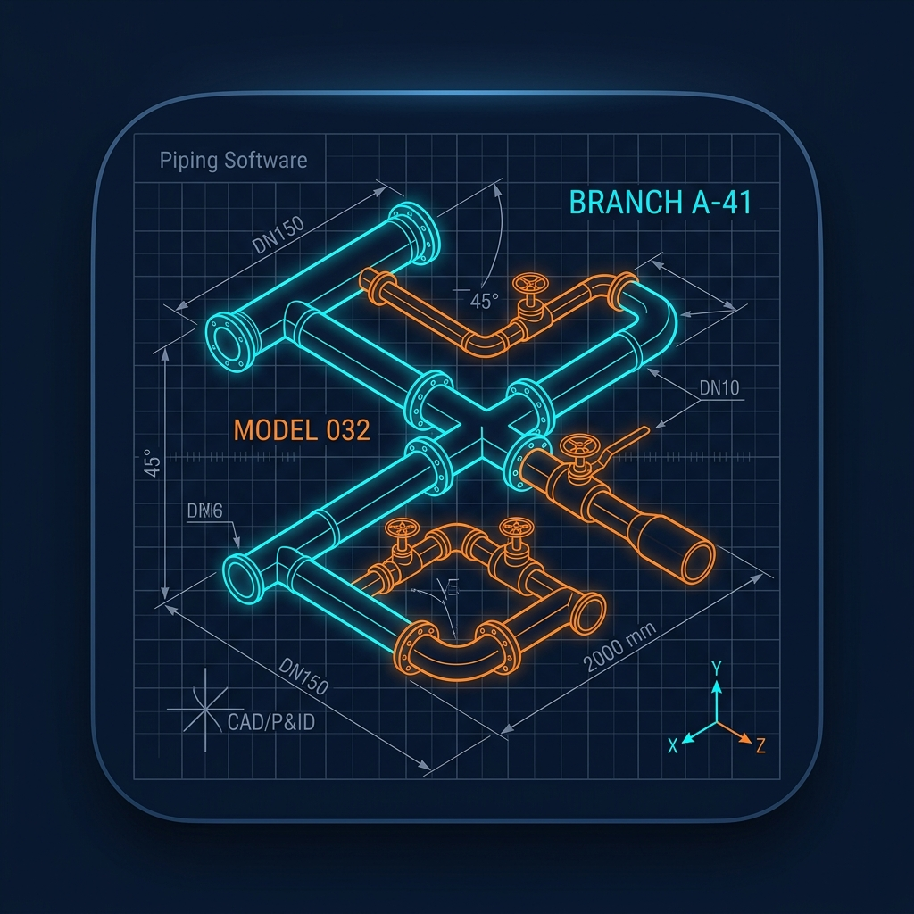
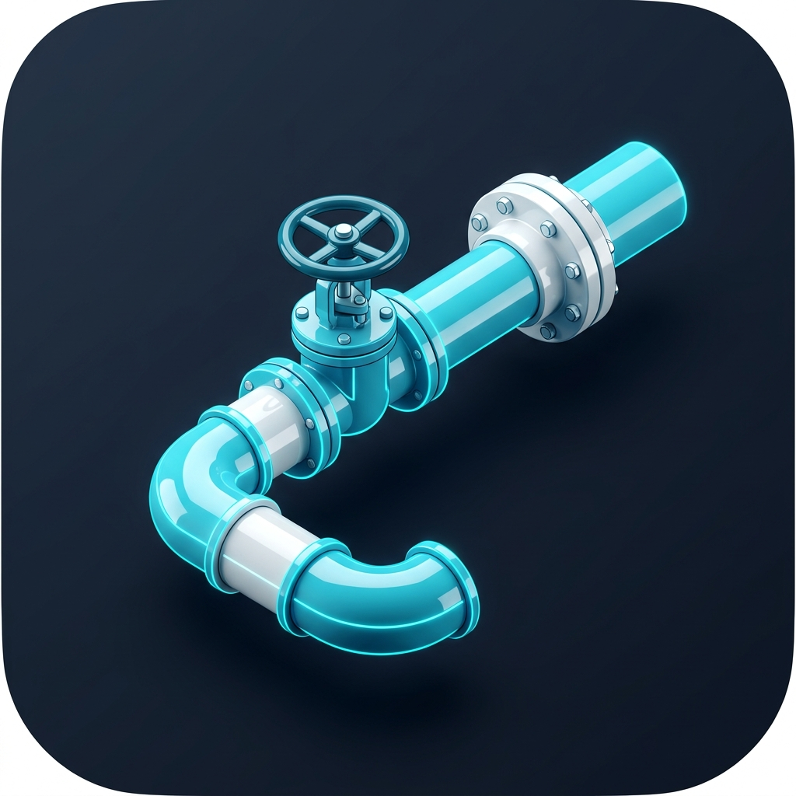
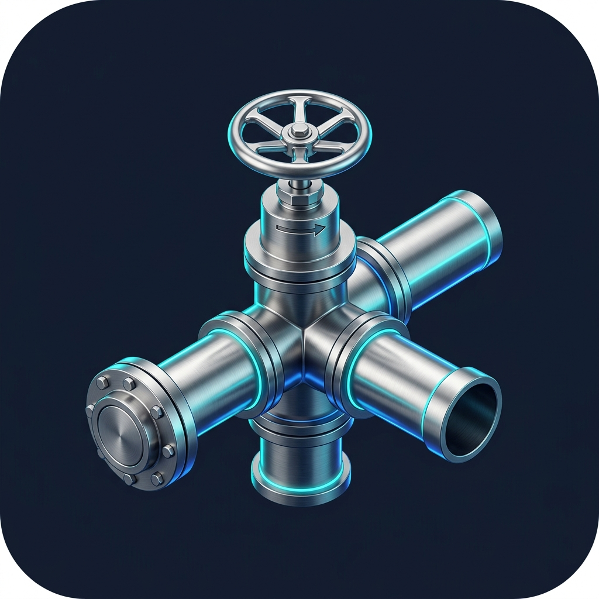

# Варианты логотипа для Akso 3D

Здесь собраны все предложенные концептуальные варианты логотипа для приложения:

---

### Вариант 1: «Изометрическая буква A»
Буква **«A»** (Akso / Аксонометрия) с гранями изометрического объема, через которую проходит пространственный трубопровод с осями координат **X-Y-Z** и неоновой подсветкой.
- Файл: `вариант_1_изометрическая_А.jpg`

---

### Вариант 2: «Изометрический куб (Сетка / Аксонометрия)»
Лаконичный куб в аксонометрии, грани которого образованы гладкими трубами, соединенными стандартными отводами и тройниками. Очень чистый, современный стиль, отлично читается даже на мелких иконках (16x16 / 32x32).
- Файл: `вариант_2_изометрический_куб.jpg`

---

### Вариант 3: «CAD Blueprint / Чертёж»
Настоящий инженерный чертеж: светящаяся пространственная аксонометрическая схема трубопроводной сети на координатной сетке с размерами, диаметрами и осями.
- Файл: `вариант_3_чертеж_blueprint.jpg`

---

### Вариант 4: «Абстрактный гексагон / Узел связности»
Премиальный геометрический знак САПР из трех переплетенных трубных контуров (сатинированный хром и бирюза).
- Файл: `вариант_4_гексагон_узел.jpg`

---

### Вариант 5: «Лаконичная 3D-трасса»
Чистый участок реальной трубопроводной трассы (отвод 90°, задвижка с маховиком, фланец) в ярком контрастном бирюзово-белом стиле.
- Файл: `вариант_5_3д_трасса.jpg`

---

### Вариант 0: «Исходный узел с арматурой»
Первоначальный вариант с 3D-крестовиной, вентилем и фланцем на болтах.
- Файл: `вариант_0_исходный_узел.jpg`

